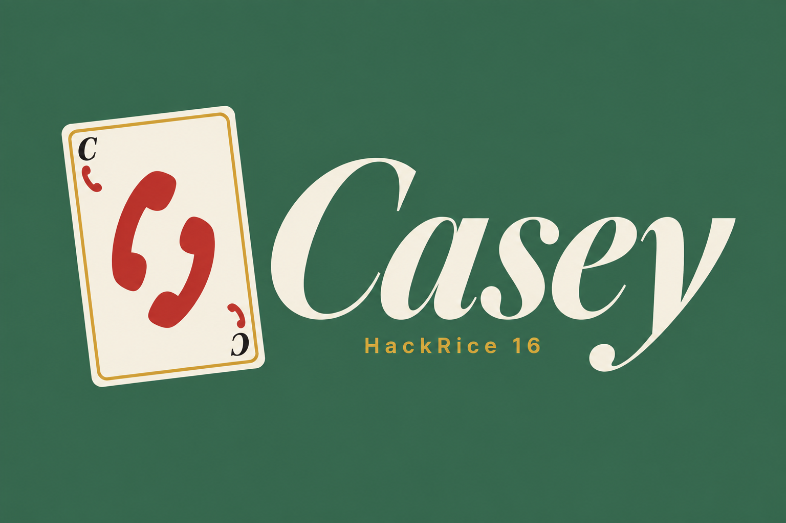
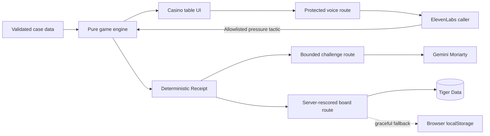

<p align="center">
  
</p>

<h1 align="center">Casey</h1>

<p align="center">
  <strong>Take the call. Verify everything.</strong>
</p>

<p align="center">
  A voice-first social-engineering investigation game built for HackRice 16.
</p>

## The idea

Casey turns independent verification into a tense, two-minute game.

A persuasive fictional caller presents an urgent claim. The player must investigate,
open artifacts, trace where each claim originated, and pin up to three pieces of evidence
into a **Trust Chain**. The final verdict can be **Scam**, **Legitimate**, or
**Not enough evidence**.

The key lesson is provenance. A new phone call or website is not independent evidence if
the original claimant supplied it. Casey reveals those hidden source relationships in a
post-round **Receipt** and rewards players for finding a source the claimant does not
control.

## How to play

1. Enter a name and choose an automatically generated Sherlock-style leaderboard alias.
2. Select a case from the Baker Street casino table.
3. Answer the fictional caller and watch for pressure tactics.
4. Investigate the available email, phone, directory, web, and portal routes.
5. Pin up to three artifacts into the Trust Chain.
6. Choose a verdict and place a confidence stake.
7. Read the Receipt to see the truth, source paths, tactics, and deterministic score.
8. Invite Moriarty to challenge the reasoning behind the evidence chain.

## Core features

- Three authored cases covering scam, legitimate, and unresolved outcomes
- ElevenLabs voice caller with microphone consent, live captions, and bounded game tools
- Automatic authored backup call when live voice cannot continue
- Evidence pinning with a strict three-artifact Trust Chain
- Source-provenance visualization that separates channel from ownership
- Deterministic 1,000-point scoring that never uses model output
- Casino chip confidence stakes and persistent browser-local progress
- One ranked settlement per case, with consequence-free practice replays
- Gemini-powered Moriarty cross-examination after the Receipt
- Tiger Data shared leaderboard with server-side rescoring and local fallback
- Sherlock and casino-inspired responsive UI for desktop and 390 px mobile screens
- Keyboard navigation, visible focus, reduced-motion support, and transcripts

## Sponsor integrations

### ElevenLabs

ElevenLabs powers the adaptive fictional caller. Casey requests a short-lived conversation
token through a server-only route, passes only allowlisted fictional case variables, and
accepts one strictly validated client tool: dealing a face-down pressure card. The caller
can influence the experience, but it cannot reveal evidence, decide truth, or change the
score.

### Gemini

Gemini plays Professor Moriarty after the deterministic Receipt. It phrases a focused
objection to the player's pinned evidence, while Casey chooses the challenge type,
validates the response, evaluates the selected defense, and awards the optional badge.
Gemini never creates evidence or acts as the source of truth.

### Tiger Data

Tiger Data powers the shared leaderboard. Board submissions are validated and rescored
from canonical case results on the server before storage. The leaderboard stores a public
nickname, generated username, score summary, best poker hand, and chip balance. If the
database is unavailable, the game and local progress continue normally.

## Architecture



The application keeps deterministic case truth, unlocks, scoring, and badge eligibility
inside typed code. External models add performance and adaptive phrasing without becoming
authoritative inputs.

## Tech stack

- Next.js App Router
- React and TypeScript
- Tailwind CSS
- ElevenLabs React SDK
- Google Gen AI SDK
- Tiger Data and PostgreSQL
- Framer Motion
- Vitest and Playwright

## Run locally

### Requirements

- Node.js 20 or newer
- npm

### Setup

```bash
git clone https://github.com/bhattapankaj/Casey_Hackrice.git
cd Casey_Hackrice
npm ci
cp .env.example .env.local
npm run dev
```

Open [http://localhost:3000](http://localhost:3000).

The core game remains playable without external service credentials. Add server-only
credentials to `.env.local` to activate the integrations:

| Variable | Purpose |
|---|---|
| `ELEVENLABS_API_KEY` | Creates protected ElevenLabs conversation tokens |
| `ELEVENLABS_AGENT_ID` | Selects the configured Casey caller |
| `GEMINI_API_KEY` | Enables Moriarty's generated objection copy |
| `GEMINI_MODEL` | Optional Gemini model override |
| `TIGER_DATABASE_URL` | Enables the shared Tiger Data leaderboard |
| `TIGER_DATABASE_POOL_MAX` | Optional bounded database pool size |

Never use a `NEXT_PUBLIC_` prefix for these values and never commit `.env.local`.

### Tiger Data schema

With `TIGER_DATABASE_URL` configured:

```bash
npm run db:migrate
npm run db:verify
```

The migrations are idempotent and live in [`db/migrations`](./db/migrations).

## Quality checks

```bash
npm run lint
npm run typecheck
npm run test
npm run build
npm run test:e2e
```

Run the complete lint, type, unit-test, and production-build sequence with:

```bash
npm run check
```

Provider tests use mocks and do not consume ElevenLabs or Gemini credits.

## Privacy and safety

- All people, organizations, phone numbers, and scenarios are fictional.
- Casey never asks for real credentials, banking information, government IDs, or money.
- The required player name remains in browser storage and is not sent to the caller,
  Gemini, or Tiger Data.
- Casey does not store raw microphone audio or voice transcripts.
- Only the editable public nickname and server-derived score summary enter the shared
  leaderboard.
- Model responses, transcripts, URL values, and database payloads are treated as
  untrusted input.

## Project documentation

- [Product contract](./docs/PROJECT.md)
- [Implementation design](./docs/BUILD.md)
- [Judging strategy](./docs/JUDGING.md)
- [ElevenLabs setup](./docs/ELEVENLABS.md)
- [Gemini setup](./docs/GEMINI.md)
- [Tiger Data setup](./docs/TIGER_DATA.md)
- [Backend architecture](./docs/BACKEND.md)

## HackRice 16

- **Track:** Games & Gamification
- **Primary challenge:** Best Use of ElevenLabs
- **Additional integrations:** Gemini API and Tiger Data
- **Demo target:** One complete investigation in two minutes
- **Teaching goal:** Verify through an independently found source

Built for [HackRice 16](https://hackrice.com/).
